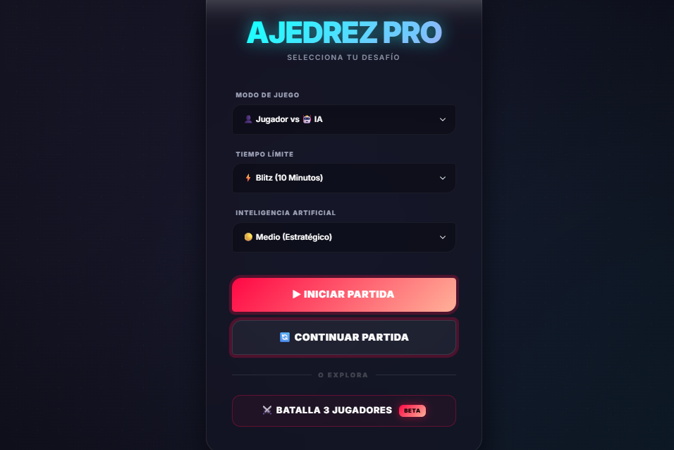
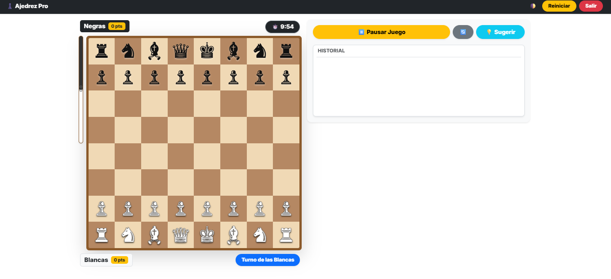

# ♟️ Ajedrez Pro - Multiplayer & IA

<div align="center">
  
  
  
  
</div>

<br />

**Ajedrez Pro** es una plataforma de ajedrez moderna y sofisticada diseñada para ofrecer una experiencia competitiva tanto contra oponentes reales como contra una inteligencia artificial avanzada. Con un enfoque en la estética *premium* y la jugabilidad fluida.

---

## 🚀 Características Principales

| Característica | Descripción |
| :--- | :--- |
| **🌐 Multijugador Online** | Juega en tiempo real con amigos mediante códigos de sala privados. |
| **🤖 IA Adaptativa** | Motor de ajedrez basado en Minimax con 5 niveles de dificultad progresivos. |
| **🏆 Liga de Campeones** | Modo torneo donde desbloqueas niveles derrotando a la computadora. |
| **💬 Chat Integrado** | Comunicación fluida durante las partidas online para una experiencia social. |
| **💎 UI/UX Premium** | Interfaz con efectos de *glassmorphism*, animaciones suaves y modo oscuro. |

---

## 🛠️ Stack Tecnológico

- **Frontend**: Vue.js 3, Vite, CSS Vanilla (Custom Design).
- **Backend**: Node.js, Express.
- **Comunicación**: Socket.io para sincronización de estados y chat.
- **Lógica**: Algoritmo Minimax con poda Alfa-Beta para la IA.

---

## 🔧 Instalación y Uso

Para ejecutar el proyecto localmente, sigue estos pasos:

1. **Clonar el repositorio:**
   ```bash
   git clone https://github.com/DeyviF-hue/ajedrez-online.git
   cd ajedrez-online
   ```

2. **Instalar dependencias:**
   ```bash
   npm install
   ```

3. **Iniciar el servidor (Backend) - ¡IMPORTANTE!:**
   *Este paso es necesario para el modo online y para que la aplicación funcione correctamente.*
   ```bash
   node server/index.js
   ```

4. **Iniciar la aplicación (Frontend):**
   ```bash
   npm run dev
   ```

---

## 🛠️ Solución de Problemas (FAQ)

**¿Por qué el tablero se ve vacío o marrón?**
Esto suele ocurrir por dos razones:
1. **JS Crash**: Asegúrate de que todos los elementos de la interfaz se hayan cargado correctamente. He añadido protecciones en el código para evitar que esto suceda.
2. **Servidor Offline**: Si intentas jugar en modo Online sin el servidor de Node.js corriendo, el juego esperará la conexión. Asegúrate de ejecutar `node server/index.js`.

---

## 📸 Capturas de Pantalla

<div align="center">
  
  <br />
  <em>Interfaz de inicio con diseño premium</em>
  <br /><br />
  
  <br />
  <em>Tablero de juego con motor de IA y Chat Online</em>
</div>

---

## ✒️ Autor

Proyecto desarrollado con ❤️ por **Deyvi**.

---

<div align="center">
  <p>¿Tienes alguna sugerencia o encontraste un bug? ¡Siéntete libre de abrir un issue!</p>
</div>
